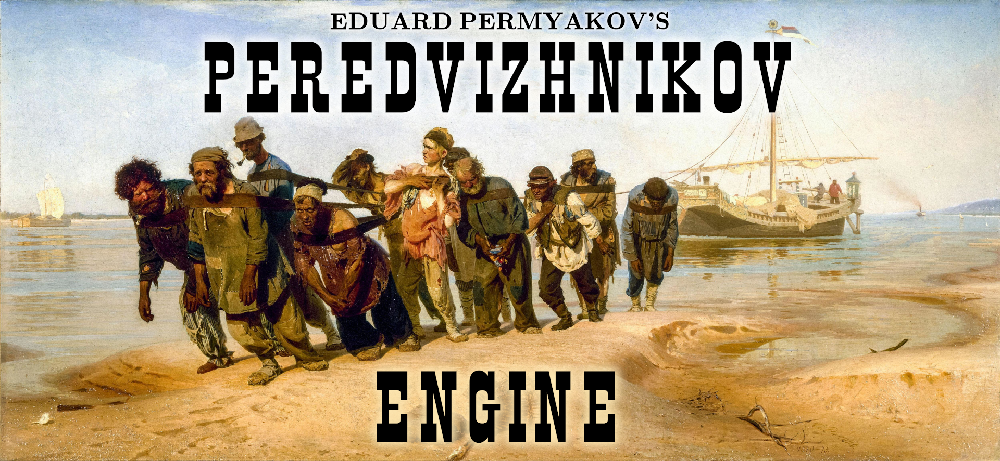

##  ##

Peredvizhnikov Engine is a fully lock-free game engine written in C++20. It implements the *actor model* of concurrent computation on top of the language's coroutine primitives.

Using the *actor model* abstraction, it is possible to develop complex, parallel logic while being wholly isolated from the details of inter-thread synchronization. A completely lock-free implementation of the model brings with it many advantages, namely guaranteed progress even in the presence of arbitrary thread termination, deadlock-freedom, predictable latency in reacting to critical events, and fault-tolerance.

In fact, the degree of fault-tolerance in Peredvizhnikov Engine is so great, that the engine is guaranteed to continue running even when any of the worker threads is asynchronously killed. You may [verify this yourself](test/test_fault_tolerance.cpp).

The implementation is founded upon a mix of classical and novel ideas in lock-free programming. It includes [a novel implementation of Software Transactional Memory](src/atomic_struct.cpp), [a new kind of lock-free queue](src/lockfree_sequenced_queue.cpp), [an original lock-free serialization primitive](src/atomic_work.cpp), [a lock-free std::atomic_shared_ptr](src/atomic_shared_ptr.cpp), [a lock-free scheduler](src/scheduler.cpp), [a lock-free memory allocator](src/alloc.cpp) and plenty more!

For a detailed breakdown of all the lock-free algorithms that went into realizing the engine, rationale for the design, benchmarks, and more, please take a look at the accompanying document: [Peredvizhnikov Engine: Design and Implementation of a Completely Lock-Free Scheduler](docs/lockfree.pdf).

## Building Peredvizhnikov Engine ##

At the moment, the only supported platform is Linux. Clang++ 16.0.0 is required to build the sources.

1. `git clone https://github.com/eduard-permyakov/peredvizhnikov-engine.git`
2. `cd peredvizhnikov-engine`
3. `make -j16 DEBUG=0`

## License ##

The source code of Peredvizhnikov Engine is freely available under the GPLv3 license. However, I may grant permission to use parts or all of the code under a different license on a case-by-case basis. Please inquire by e-mail.

## Contact ##

You may contact me with any questions, comments, or concerns pertaining to the source code or the underlying algorithms.

In addition, I am currently actively seeking employment. Please don't hesitate to reach out regarding any suitable opportunities.

My e-mail is: edward.permyakov@gmail.com
